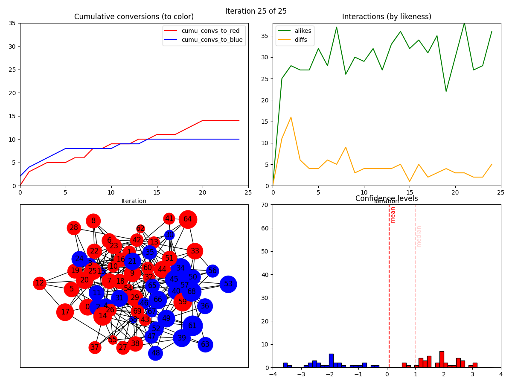

# Tidal

An agent-based opinion dynamics model, incorporating some recent ideas from
[ANNSIM 2024](https://annsim.org/) and [INSNA Sunbelt 2024](https://sunbelt2024.com/).

## Screenshot

<p align="center">
    
</p>

## Installation and setup

Make sure your Python environment has
[Mesa](https://github.com/projectmesa/mesa),
[networkx](https://networkx.org/documentation/stable/), NumPy, Pandas, and
matplotlib installed:

```
    $ pip install mesa networks numpy pandas matplotlib
```

and then run the single Python file `tidal.py`, whose command-line usage is
shown below.

## Usage

```
    tidal.py [-h] [-n NUM_SIMS] [--seed SEED] [--MAX_STEPS MAX_STEPS]
             [-N N] [--graph_type {ER,SBM}]
             [--graph_params GRAPH_PARAMS [GRAPH_PARAMS ...]]
             [--agent_class {Messaging,Community}] [--prop_red PROP_RED]
             [--confidence_malleability CONFIDENCE_MALLEABILITY]
             [--cap_confidence | --no-cap_confidence]
             [--bidirectional_influence | --no-bidirectional_influence]
             [--extraversion EXTRAVERSION]
             [--animate_only_on_step | --no-animate_only_on_step]
             [--plot_mean | --no-plot_mean]

options:
  -h, --help            show this help message and exit
  -n NUM_SIMS, --num_sims NUM_SIMS
                        Number of sims to run (1 = single, >1 = batch)
  --seed SEED           Random seed.
  --MAX_STEPS MAX_STEPS
                        Maximum number of steps before simulation terminates.
  -N N                  Number of agents.
  --graph_type {ER,SBM}
                        Random graph-generating algorithm.
  --graph_params GRAPH_PARAMS [GRAPH_PARAMS ...]
                        Random graph-generating algorithm parameters (ER: p.
                        SBM: n1 n2 p11 p12 p22).
  --agent_class {Messaging,Community}
                        Prefix of agent class name (prepended to 'Citizen').
  --prop_red PROP_RED   Proportion of agents initially red.
  --confidence_malleability CONFIDENCE_MALLEABILITY
                        To what degree is confidence boosted/devastated by
                        (dis)agreement.
  --cap_confidence, --no-cap_confidence
                        Impose maximum confidence of 1.0 on each agent?
  --bidirectional_influence, --no-bidirectional_influence
                        Listener also (symmetrically) influences speaker?
  --extraversion EXTRAVERSION
                        Probability of each agent sending message each step.
  --animate_only_on_step, --no-animate_only_on_step
                        Only draw new animation frame on entire step of sim?
  --plot_mean, --no-plot_mean
                        Plot mean and median confidence on histogram?
```
